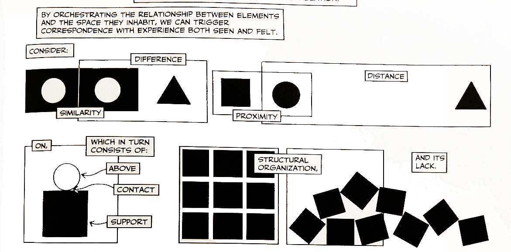
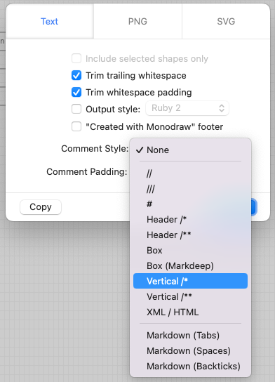

Lors d'une présentation sur les structures de données, j'ai enfin compris l'idée de "structural sharing" lorsque l'intervenante [a utilisé un schéma pour l'expliquer](https://youtu.be/Wo0qiGPSV-s?t=688).

Une image est une façon efficace de communiquer les relations entre des éléments, la distance, la taille, le temps, qui sont tous des concepts pertinents dans un programme.



Un commentaire de code est aussi un outil de communication : il peut expliquer une abstraction, une implémentation, ou donner du contexte. Il est la documentation la plus proche du code, où on en a le plus besoin.

On devrait plus souvent utiliser des images dans nos commentaires.
  
Voici deux exemples :

```
              Les données sont partagées
     ┌───────────┐               ┌───────────┐
     │ Version A │               │ Version B │
     └───────────┘               └───────────┘
           │                           │
           │                           │
           ├─────────┐┌────────────────┤
           │         ││                │
         ┌─▼─┐     ┌─▼▼┐             ┌─▼─┐
         │ 1 │     │ 2 │             │ 3 │
         └───┘     └───┘             └───┘

                   ──────────────
              Les données sont copiées
    ┌───────────┐               ┌───────────┐
    │ Version A │               │ Version B │
    └───────────┘               └───────────┘
          │                           │
          ├─────────┐             ┌───┴───┐
          │         │             │       │
        ┌─▼─┐     ┌─▼─┐         ┌─▼─┐   ┌─▼─┐
        │ 1 │     │ 2 │         │ 2 │   │ 3 │
        └───┘     └───┘         └───┘   └───┘
```

```

                      .─.     .─.     .─.     .─.
    Intervalle       ( 1 )   ( 2 )   ( 3 )   ( 4 )
                   ───`─'─────`─'─────`─'─────`─'──▶
                   ┌──────────────────┐
                   │ Opérateurs RxJS  │
                   └──────────────────┘
   ┌─────────────┐    .─.                     .─.
   │throttleTime │   ( 1 )                   ( 4 )
   └─────────────┘ ───`─'─────────────────────`─'──▶
   ┌─────────────┐                ┌─.─.──.─.─┐
   │ bufferTime  │                │( 1 )( 2 )│
   └─────────────┘ ───────────────┴─`─'──`─'─┴─────▶
```

Ces "images" ont été créées par [monodraw](https://monodraw.helftone.com), une application macos payante (mais pas très chère) qui peut exporter ce genre de dessins au format texte.



### Rester raisonnable

Un dessin dans un commentaire, puisqu'il est fait dans un format aussi peu propice, devrait rester petit et simple.

Un diagramme trop grand n'a pas sa place dans un commentaire de code, ni d'ailleurs un grand nombre de petites images. Ils risquent de monopoliser l'espace à l'écran et de compliquer la compréhension plutôt que de la faciliter.  

Si vous pensez qu'une grande illustration est nécessaire, elle aura sa place dans une base de connaissance externe.

### Alternatives

Diverses options de "diagrams as code" existent : [PlantUML](https://crashedmind.github.io/PlantUMLHitchhikersGuide/about/AboutPlantUML.html) ou encore [Mermaid](https://github.blog/2022-02-14-include-diagrams-markdown-files-mermaid/). Ces outils permettent de faire de vrais schémas et vont bien au-delà de ce qui est réalisable en texte, mais nécessitent d'installer un composant supplémentaire, et ne fonctionnent donc pas avec n'importe quel éditeur de texte.

Mettre un lien vers une image externe, dans un wiki par exemple, est également faisable, mais cela sépare "physiquement" l'image du code qu'elle doit expliquer. Cela accroit le risque de décalage entre le code et l'image : une personne qui mettra à jour le code n'ira pas forcément répliquer le changement sur l'image, et vice-versa.  
De plus, quelqu'un pourra trouver l'image dans le wiki et ne pas savoir à quel code elle se réfère.

### L'importance du texte

L'image ne doit pas remplacer complètement le texte :  
- il peut être versionné,
- être trouvé par un moteur de recherche,
- être lu par les assistants vocaux.

Communiquer des idées avec des images semble évident partout : dans l'art, dans l'éducation, le marketing... Pourquoi ne pas s'en servir dans les commentaires ?

Bonne sieste