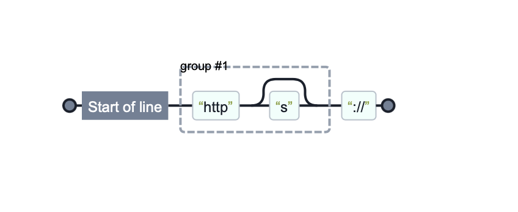

Pour l'un des premiers projets sérieux sur lesquels j'ai travaillé durant mes études, lors d'un stage, j'ai utilisé des expressions régulières pour extraire des données d'un document HTML.  
J'aurais aimé que quelqu'un m'en dissuade, mais personne ne l'a fait, ce qui a conduit à une regex monstrueuse et beaucoup de fatigue.  

Voici donc un article dans lequel je donne quelques exemples de situations pour lesquelles, si les regex peuvent sembler une bonne solution, elles sont, en fait, un piège.

## Qu'est-ce qu'une expression régulière ?

Une "regex" est une notation utilisée pour décrire un **langage** : des lettres et des mots gouvernés par une grammaire.  
Par exemple : le langage décrit par `ab*c` inclut des chaines de caractères qui contiennent la lettre `a` suivie d'un nombre indéterminé de `b`, suivi d'un `c`.

La [syntaxe](https://www.regular-expressions.info/refquick.html) contient des caractères littéraux, des métacaractères (`.`), des quantifieurs (`+`), de l'alternance (`|`), des drapeaux (`m`), et autres.

```
    A   |   B   .   +
    ─┬─ ─┬─     ─┬─ ─┬─
     ▼   │       │   ▼
littéral │       │  quantifieur
         ▼       │
     alternance  │
                 ▼
            métacaractère
```

Dans le contexte de la programmation, elles sont utilisées pour trouver des chaines de caractères qui correspondent au langage décrit. Le traitement de texte, la génération de texte et la validation de données sont des cas d'utilisation typiques.

## Quand ne PAS utiliser une expression régulière 🛑

- Analyser un langage qui permet des imbrications infinies, comme un langage de programmation ou de balisage (*"Combien y a-t'il de liens dans ce document HTML ?*)
- Valider une donnée complexe (*"Est-ce que cette adresse email est valide ?"*)
- Analyse de langage naturel (*"Quel est le sujet de cette phrase ?"*)

<section class="warning">
<p>
Lorsqu'on construit une regex pour extraire quelque chose d'un texte, <strong>il est souvent facile d'inclure ce qu'on veut mais difficile d'exclure ce qu'on ne veut pas</strong>.  

Autrement dit : les exceptions sont une plaie.  
</p>
</section>

### Exemples d'alternatives

- **Analyse de document XML** : xpath, ou utiliser un <abbr title="Document Object Model">DOM</abbr>.
- **Valider une adresse email** : vérifier qu'elle contient `@` puis lui envoyer un email contenant un lien de vérification.
- **Analyse de langage naturel** : utiliser une bibliothèque dédiée (Tensorflow, ...)

## Quand utiliser une expression régulière ✅

- Chercher une information simple dans un texte (*"Quels sont tous les numéros de téléphone français dans ce texte ?"*)
- Validation de chaine de caractères basée sur un motif simple (*"Est-ce une date au format ISO8601 ?*)
- Extraire d'une chaine des composants finis et simples (*"Quel est le nom d'hôte de cette URL ?"*)
- Fonctionnalité "rechercher et remplacer"
- Générer des données de test dans un format spécifique

## Différences entre théorie et implémentation

<aside class="my-comment">
<p>
Il est utile d'imaginer une expression régulière comme un programme extrêmement concis.  

Ce programme est un "automate fini déterministe".
</p>
</aside>

En cherchant de la documentation sur les regex sur internet, vous pouvez tomber sur des informations contradictoires comme par exemple:  
- *"mémoire limitée"*
- *"vous pouvez référencer n'importe quel nombre de groupes capturants"*

```
    ^(https?)://
      ────┬───
          ▼
groupe capturant
```

Cela s'explique par le fait que selon le contexte, "expression régulière" peut désigner le concept théorique ou ses implémentations pratiques comme les bibliothèques logicielles.  
Ces dernières ont désormais des fonctionnalités qui vont bien au-delà de ce qui était possible avec des <abbr title="Finite State Machines (automatons)">FSM</abbr>.

Par exemple, <abbr title="Perl-Compatible Regular Expressions">PCRE</abbr> a des fonctionnalités d'assertions (["lookaround"](https://www.regular-expressions.info/lookaround.html)) et de récursivité.

## En pratique

Quasiment tous les environnements de programmation permettent l'utilisation des expressions régulières.  
Voici quelques exemples :

### Unix

Les célèbres programmes `grep` et `awk`.

### PHP

Toutes les [fonctions](https://www.php.net/manual/fr/ref.pcre.php) préfixées par `preg_` sont basées sur PCRE.  
Il y a quelques particularités, notamment `preg_match_all()` qui remplace le drapeau `g` (global).

Des exemples intéressants peuvent être trouvés dans la base de code [league/uri](https://github.com/thephpleague/uri/blob/master/Uri.php) :

```php
private const REGEXP_HOST_REGNAME = '/^(
    (?<unreserved>[a-z\d_~\-\.])|
    (?<sub_delims>[!$&\'()*+,;=])|
    (?<encoded>%[A-F\d]{2})
)+$/x';

// ...
return match (true) {
    1 === preg_match(self::REGEXP_HOST_REGNAME, $formattedHost) => $formattedHost,
    1 === preg_match(self::REGEXP_HOST_GEN_DELIMS, $formattedHost) => throw new SyntaxError('...'),
    default => $formatter($host),
};
```

### JavaScript

L'objet `RegExp` fait partie du langage. De plus, les regex ont une forme littérale :

```js
/ab*c/.test("abbbc")
```

Plus d'informations sur [MDN](https://developer.mozilla.org/fr/docs/Web/JavaScript/Reference/Global_Objects/RegExp).

## Outils

- [iHateRegex](https://ihateregex.io/) permet de visualiser une regex par un graphe, ce qui illustre bien son origine d'automate.
- [regex101](https://regex101.com/) est un éditeur interactif qui explique bien chaque composant d'une expression et permet de choisir une implémentation (PCRE, JavaScript, ...).
- [phprex](https://phphub.net/regex/) est un autre éditeur interactif pour PHP qui permet également de visualiser une regex par un graphe.
- [regular-expressions.info](https://www.regular-expressions.info/) est une bonne source de documentation (en anglais).



## Un peu d'histoire

- [Stephen Kleene](https://fr.wikipedia.org/wiki/Stephen_Cole_Kleene) semble être considéré comme l'inventeur des expressions régulières, au début des années 1950.
- Dans les années 50 également, Chomsky présente sa [hiérarchie des langages](https://fr.wikipedia.org/wiki/Hiérarchie_de_Chomsky).
- [ED, l'éditeur de texte de Ken Thompson](https://fr.wikipedia.org/wiki/Ed_(logiciel)) est l'un des premiers programmes à utiliser les regex, à la fin des années 1960.
- Dans les années 1980, [PERL](https://en.wikipedia.org/wiki/Regular_expression#Perl_and_PCRE) offre des regex aux fonctionnalités encore plus puissantes.

Bonne sieste
